# System Design Diagrams

## Project: Spotify Clone (Kotlin Native, No Backend, Google Drive + Local Files)

---

# 1. High-Level System Architecture

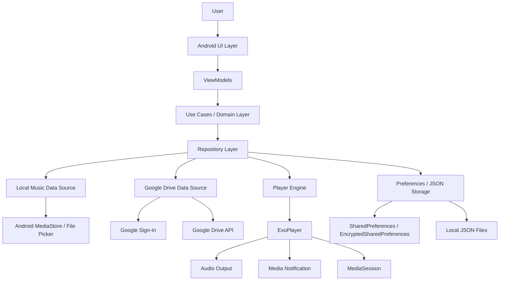

---

# 2. Clean Architecture Layer Diagram

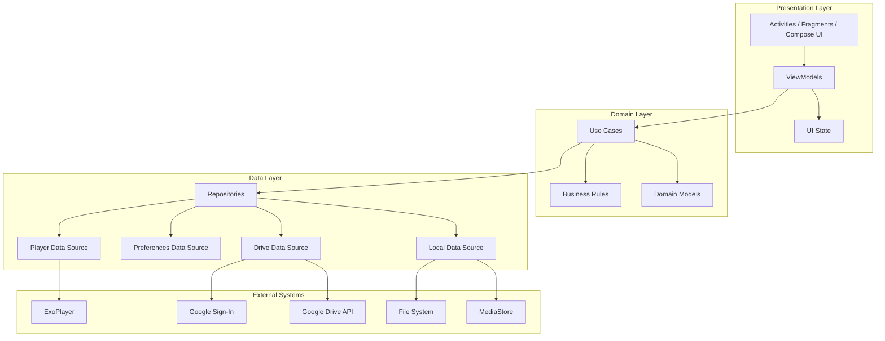

---

# 3. App Module Structure Diagram

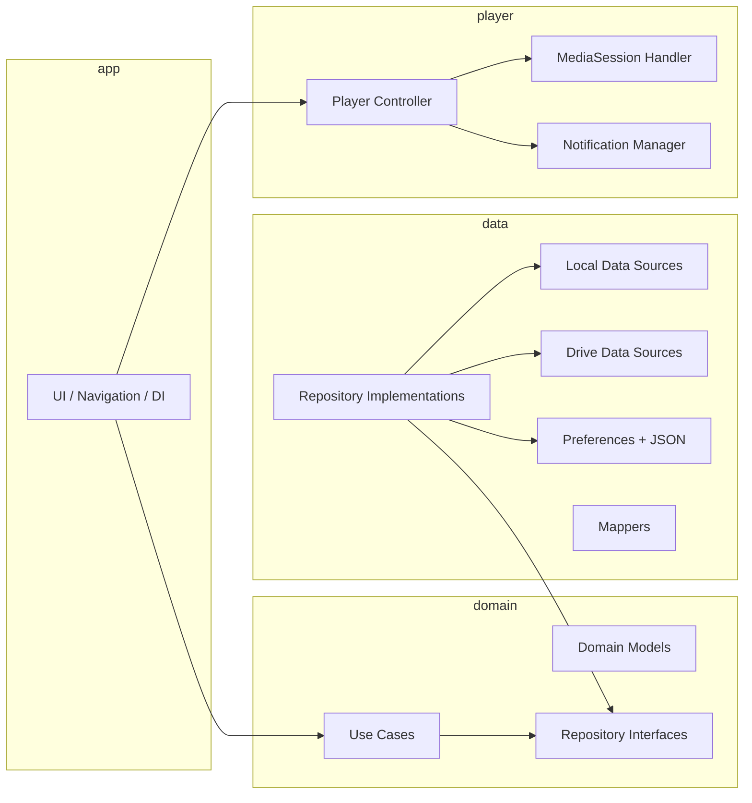

---

# 4. Local Music File Flow

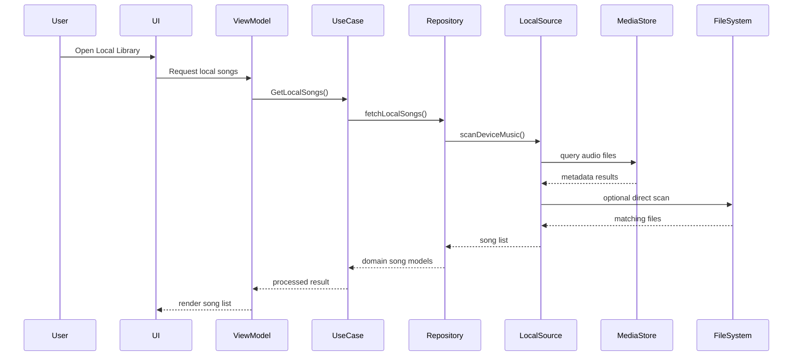

---

# 5. Google Drive Music Flow

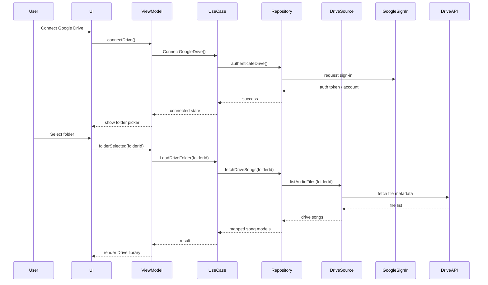

---

# 6. Unified Music Source Design

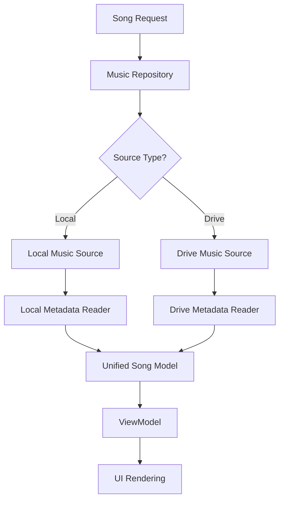

---

# 7. Song Domain Model Relationship

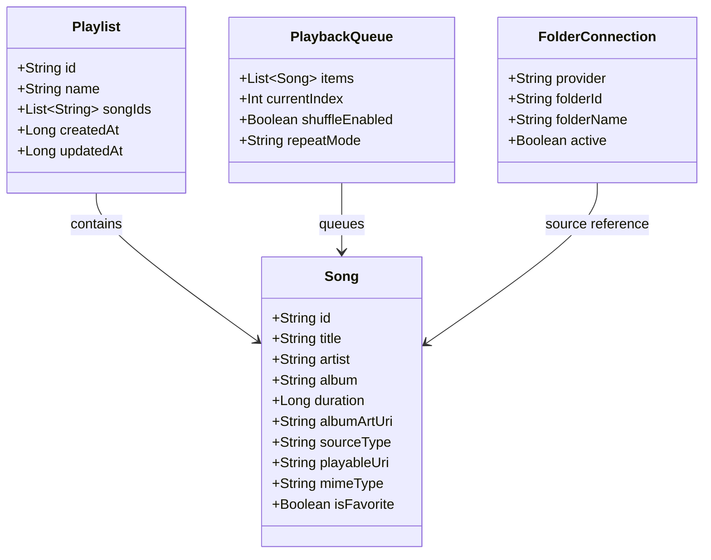

---

# 8. Playback System Design

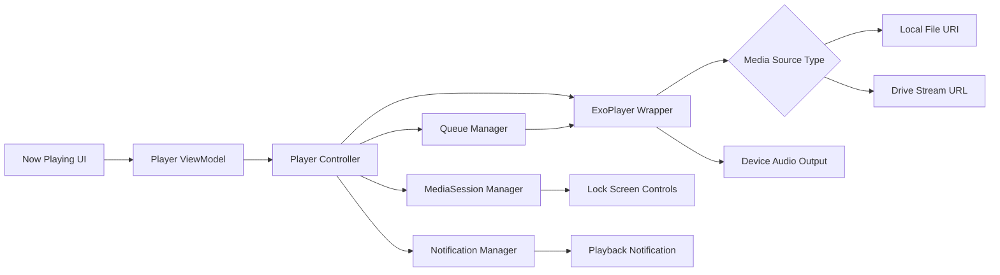

---

# 9. Playback Sequence: Local or Drive Song

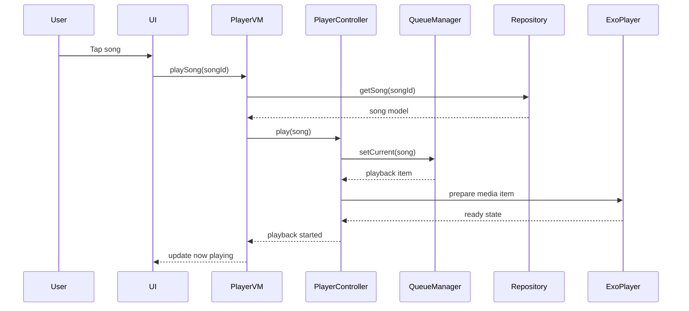

---

# 10. Search System Design

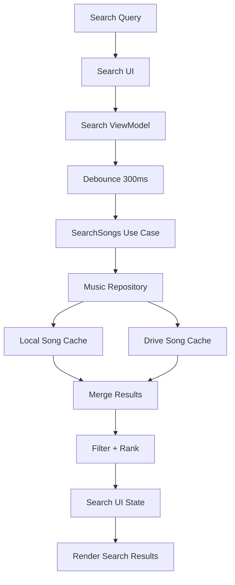

---

# 11. Playlist Management Design

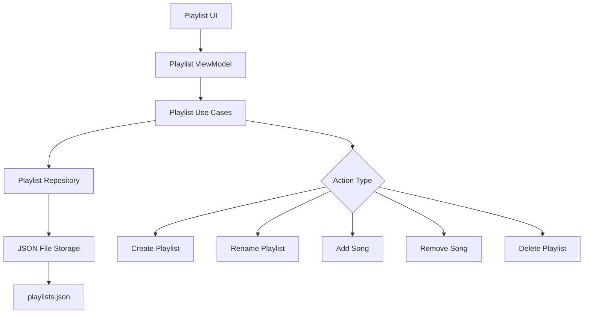

---

# 12. Favorites / Likes Design

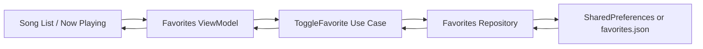

---

# 13. Settings and Persistence Design

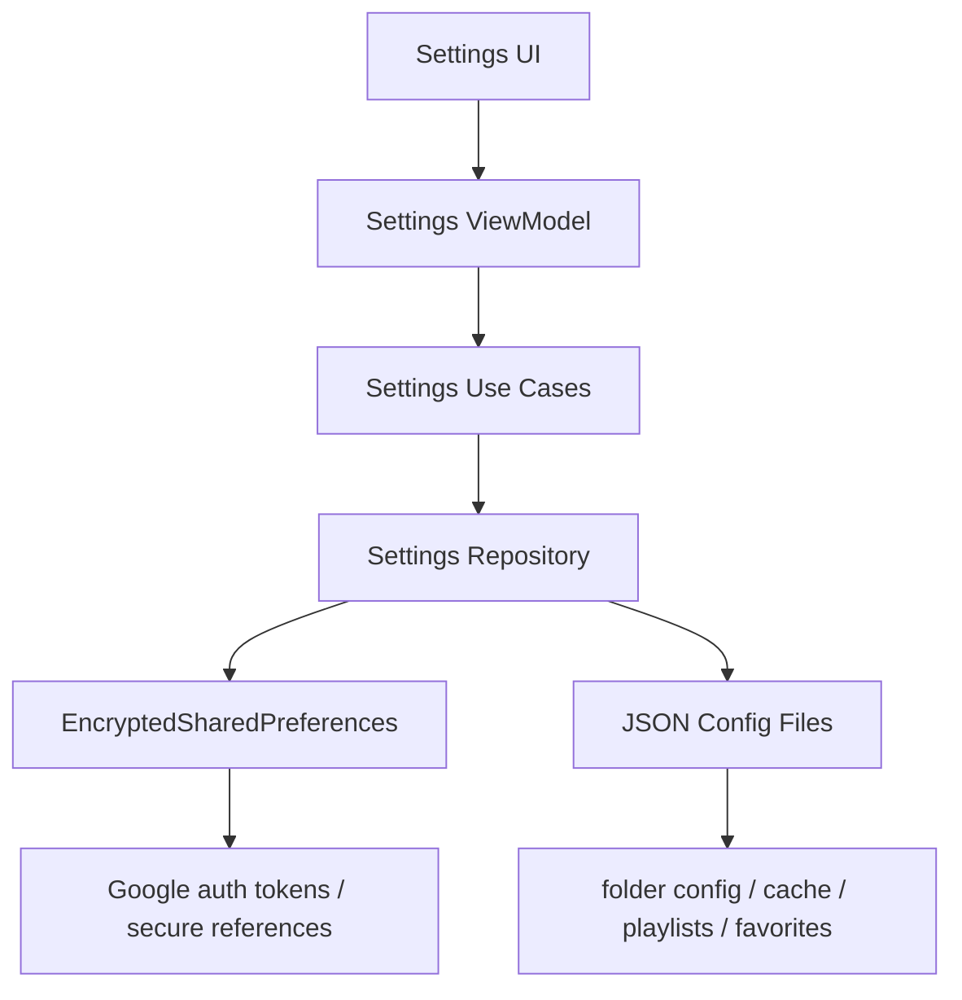

---

# 14. Google Drive Authentication and Access Design

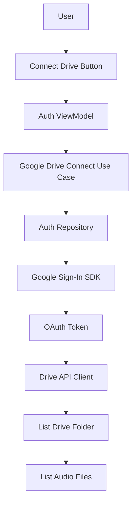

---

# 15. Caching Strategy Diagram

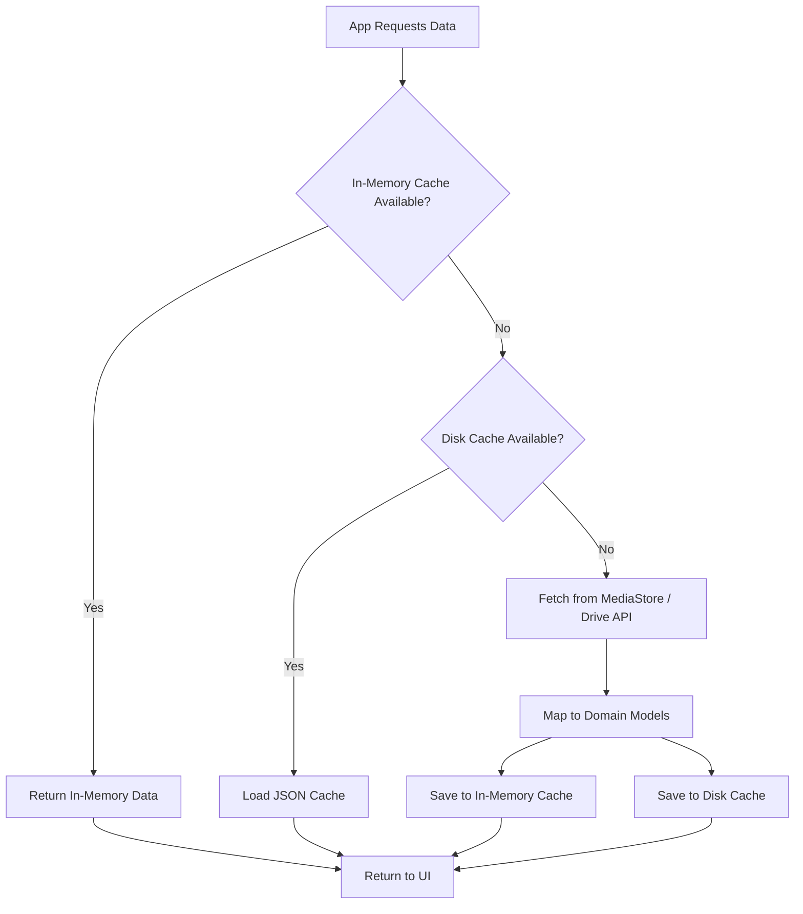

---

# 16. Background Playback and Notification Flow

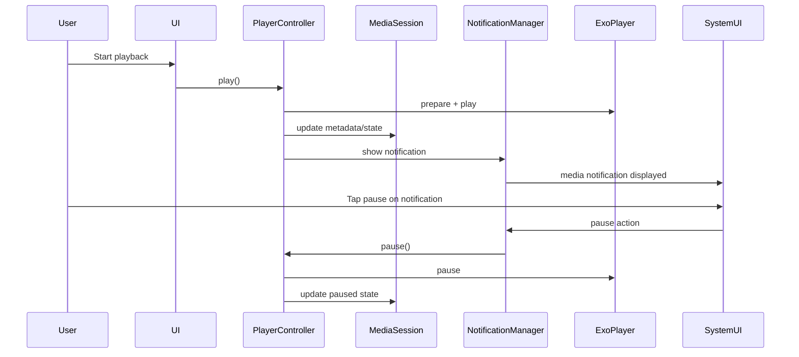

---

# 17. Error Handling Design

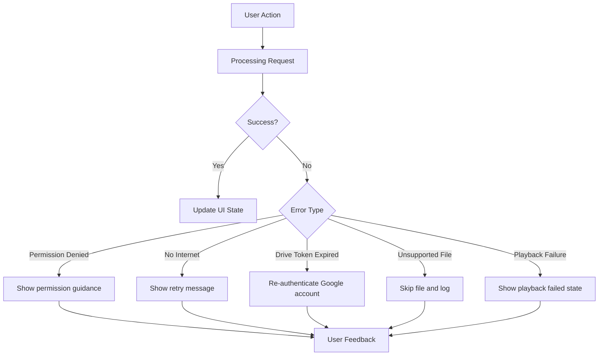

---

# 18. Permissions Design

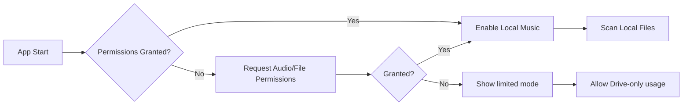

---

# 19. End-to-End User Journey Diagram

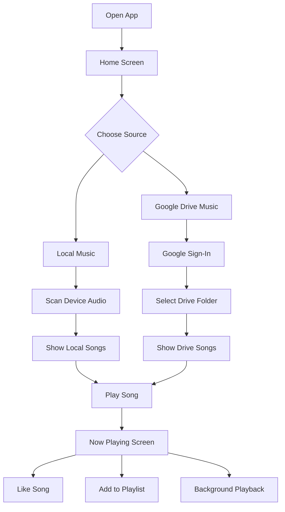

---

# 20. Recommended Package Structure

```mermaid
flowchart TD
    ROOT[com.example.spotifish]

    ROOT --> PRESENTATION[presentation]
    ROOT --> DOMAIN[domain]
    ROOT --> DATA[data]
    ROOT --> PLAYER[player]
    ROOT --> CORE[core]

    PRESENTATION --> HOMEUI[home]
    PRESENTATION --> SEARCHUI[search]
    PRESENTATION --> LIBRARYUI[library]
    PRESENTATION --> PLAYERUI[player]
    PRESENTATION --> SETTINGSUI[settings]

    DOMAIN --> USECASES[usecase]
    DOMAIN --> MODELS[model]
    DOMAIN --> REPOIF[repository]

    DATA --> REPOIMPL[repository]
    DATA --> LOCAL[local]
    DATA --> DRIVE[drive]
    DATA --> PREFS[prefs]
    DATA --> CACHE[cache]
    DATA --> MAPPER[mapper]

    PLAYER --> CTRL[controller]
    PLAYER --> SESSION[session]
    PLAYER --> NOTIF[notification]
    PLAYER --> SERVICE[service]

    CORE --> DI[di]
    CORE --> UTIL[util]
    CORE --> EXT[extensions]
```

---

# 21. Suggested Service-Level Design for Playback

```mermaid
flowchart TD
    UI[UI Layer] --> BINDER[Bound Player Service Interface]
    BINDER --> SERVICE[Foreground Playback Service]
    SERVICE --> PLAYERCTRL[Player Controller]
    PLAYERCTRL --> EXO[ExoPlayer]
    PLAYERCTRL --> SESSION[MediaSession]
    SERVICE --> NOTIF[Persistent Notification]
```

---

# 22. Data Source Decision Diagram

```mermaid
flowchart TD
    SONG[Selected Song] --> TYPE{sourceType}

    TYPE -->|LOCAL| LOCALFLOW[Use file:// or content:// URI]
    TYPE -->|DRIVE| DRIVEFLOW[Request authenticated Drive stream URL]

    LOCALFLOW --> PLAYER[Pass media item to ExoPlayer]
    DRIVEFLOW --> TOKENCHECK{Valid Token?}
    TOKENCHECK -->|Yes| PLAYER
    TOKENCHECK -->|No| REFRESH[Re-authenticate / refresh token]
    REFRESH --> PLAYER
```

---

# 23. Offline-First Behavior Diagram

```mermaid
flowchart LR
    OPENAPP[Open App] --> LOADCACHED[Load Cached Metadata]
    LOADCACHED --> SHOWUI[Render UI Quickly]

    SHOWUI --> SYNCCHK{Source Available?}
    SYNCCHK -->|Local Available| REFRESHLOCAL[Refresh Local Scan]
    SYNCCHK -->|Drive Connected + Internet| REFRESHDRIVE[Refresh Drive File List]
    SYNCCHK -->|Unavailable| KEEPOLD[Keep Cached State]

    REFRESHLOCAL --> UPDATEUI[Update UI]
    REFRESHDRIVE --> UPDATEUI
    KEEPOLD --> UPDATEUI
```

---

# 24. JSON Storage Design

```mermaid
flowchart TD
    subgraph App Storage
        A[favorites.json]
        B[playlists.json]
        C[drive_folder_config.json]
        D[cached_songs.json]
        E[settings.json]
    end

    A --> F[Favorite Song IDs]
    B --> G[Playlist Definitions]
    C --> H[Selected Drive Folder ID]
    D --> I[Cached metadata]
    E --> J[Theme / preferences]
```

---

# 25. Deployment Context Diagram

```mermaid
flowchart LR
    USER[Android User] --> APP[Native Kotlin Android App]
    APP --> STORAGE[Device Storage / MediaStore]
    APP --> GOOGLEAUTH[Google Sign-In]
    APP --> GDRIVE[Google Drive API]
    APP --> AUDIO[Android Audio System]
    APP --> SYSUI[Notifications / Lock Screen]
```

---

## Notes for Implementation

### Recommended stack

- **UI:** Jetpack Compose or XML
- **Playback:** ExoPlayer
- **DI:** Hilt or Koin
- **Async:** Kotlin Coroutines + Flow
- **Architecture:** MVVM + Clean Architecture
- **Storage:** SharedPreferences + JSON files
- **Drive:** Google Sign-In + Drive REST API

### Important design choice

Since the app has **no backend and no traditional database**, the architecture should treat:

- **MediaStore** as local metadata provider
- **Google Drive API** as remote metadata provider
- **JSON + preferences** as lightweight persistence layer
- **In-memory cache** as performance layer
